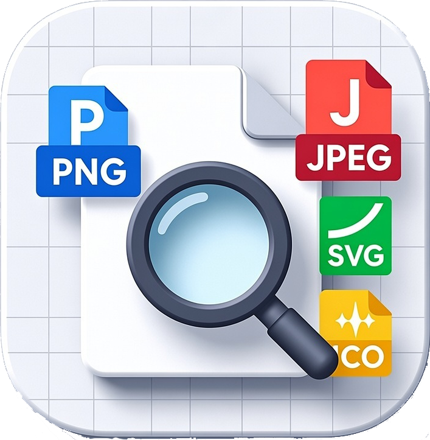

# Pix3lIconv

A simple and intuitive converter for PNG, JPEG, and SVG images to multi-resolution ICO format for Windows.


## Features

- **Multiple Format Support**: Convert PNG, JPEG, JPG, SVG, and SVGZ images to ICO format
- **Multi-Resolution ICO**: Generates ICO files with 16x16, 32x32, 48x48, and 256x256 resolutions
- **Live Preview**: Real-time preview of the selected image before conversion
- **Drag & Drop**: Simply drag and drop image files into the application
- **Keyboard Shortcuts**: Quick access with Ctrl+O (Open) and Ctrl+Q (Quit)
- **SVG Support**: Full support for vector graphics with antialiasing
- **User-Friendly Interface**: Clean and intuitive English interface

## Application Icon

<p align="center">
  
</p>

## Requirements

- Windows 7 or later
- Qt 6.9.1 or later (for building from source)
- MinGW 13.1.0 or compatible compiler (for building from source)

## Installation

### Pre-built Binary

1. Download the latest release from the [Releases](../../releases) page
2. Extract the ZIP file
3. Run `Pix3lIconv.exe`

### Building from Source

1. Install Qt 6.9.1 or later with MinGW
2. Clone the repository:
   ```bash
   git clone https://github.com/Pix3ltools-lab/Pix3lIconv.git
   cd Pix3lIconv
   ```
3. Build the project:
   ```bash
   qmake
   mingw32-make
   ```
4. The executable will be in the `release` folder

## Usage

### Opening an Image

There are three ways to load an image:

1. **Browse Button**: Click the "Browse..." button and select an image file
2. **File Menu**: Use `File → Open Image...` or press `Ctrl+O`
3. **Drag & Drop**: Drag an image file from Windows Explorer and drop it onto the application window

### Converting to ICO

1. Load an image using one of the methods above
2. Preview the image in the preview area
3. Click the "Convert to .ico" button
4. Choose the location and filename for the ICO file
5. The application will create a multi-resolution ICO file (16x16, 32x32, 48x48, 256x256)

### Supported Formats

**Input Formats:**
- PNG (*.png)
- JPEG (*.jpg, *.jpeg)
- SVG (*.svg, *.svgz)

**Output Format:**
- ICO (*.ico) - Multi-resolution Windows icon

## Keyboard Shortcuts

| Shortcut | Action |
|----------|--------|
| `Ctrl+O` | Open Image |
| `Ctrl+Q` | Exit Application |

## Technical Details

- **Framework**: Qt 6.9.1
- **Language**: C++17
- **Build System**: qmake
- **Modules Used**: Qt Widgets, Qt SVG, Qt GUI, Qt Core

## Development

### Project Structure

```
Pix3lIconv/
├── main.cpp              # Application entry point
├── mainwindow.h          # Main window header
├── mainwindow.cpp        # Main window implementation
├── pixeliconv.pro        # Qt project file
├── resources.qrc         # Qt resources file
├── resources/
│   └── icons/
│       ├── app_icon.ico  # Application icon
│       └── app_icon.png  # Application icon (PNG)
├── README.md
├── LICENSE
└── TODO.md
```

### Building in Debug Mode

```bash
qmake CONFIG+=debug
mingw32-make -j16
```

The debug executable will be in the `debug` folder.

## Contributing

Contributions are welcome! Please feel free to submit a Pull Request.

1. Fork the repository
2. Create your feature branch (`git checkout -b feature/AmazingFeature`)
3. Commit your changes (`git commit -m 'Add some AmazingFeature'`)
4. Push to the branch (`git push origin feature/AmazingFeature`)
5. Open a Pull Request

## License

This project is licensed under the MIT License - see the [LICENSE](LICENSE) file for details.

## Author

**Pix3ltools-lab**
- GitHub: [@Pix3ltools-lab](https://github.com/Pix3ltools-lab)
- X (Twitter): [@pix3ltools](https://x.com/pix3ltools)
- Email: pix3ltools@proton.me

## Acknowledgments

- Built with [Qt Framework](https://www.qt.io/)
- Icon design inspired by modern flat design principles

## Version History

### Version 1.0 (Current)
- Initial release
- Multi-resolution ICO conversion
- PNG, JPEG, and SVG support
- Drag & drop functionality
- File and Help menus
- Live preview

## Support

If you encounter any issues or have questions, please [open an issue](../../issues) on GitHub.

---

Made with ❤️ using Qt Framework
